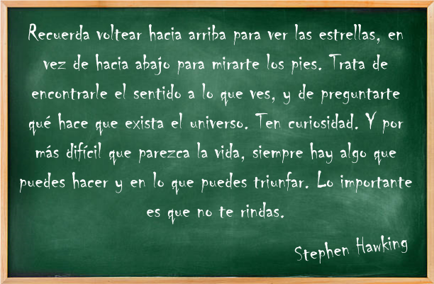

# <big><b><i>Álgebra Lineal</i></b></big>

<b>Contenido</b>

* [Introducción](https://github.com/Tlachino-M-FJ/Course-notes/blob/main/%C3%81lgebra-Lineal/Introducci%C3%B3n.ipynb)
    
* [Matrices y Ecuaciones Lineales](https://github.com/Tlachino-M-FJ/Course-notes/blob/main/Matrices_y_Ecuaciones_Lineales_Wolfram.ipynb)
    
* [Espacios Vectoriales]()
    
* Transformaciones Lineales
    
* Eigenvalores y Eigenvectores

<b>Bibliografia</b>

<small> [1]    Lang, S. (1976). Algebra lineal (No. 512.897 L3Y 1971).

<small> [2]    Hoffman, K., Kunze, R., & Finsterbusch, H. E. (1973). Álgebra lineal. Prentice-Hall Internacional.

<small> [3]   Grossman, S. I. (2008). Álgebra lineal. McGraw Hill Educación.
  
<small> [4]   [Linear Algebr, Wolfram Language & System Documentation Center](https://reference.wolfram.com/language/tutorial/LinearAlgebra.html)
